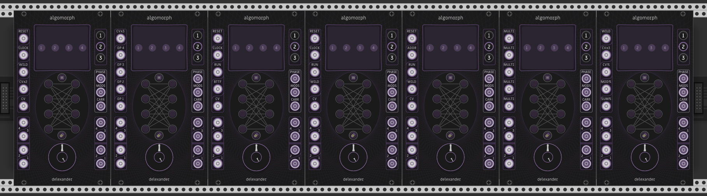

# Algomorph
Algomorph is a module for [VCV Rack](https://github.com/VCVRack/Rack).

Algomorph is an intelligent signal router, building from the familiar concepts of FM algorithms and expanding in service of both FM synthesis as well as general-purpose audio and CV routing, AM synthesis, and ring modulation.

Algomorph is capable of storing three independent routing states (i.e. algorithms) and crossfading between them. Crossfading can be controlled both manually and via control voltage, including at audio rates.

Algomorph includes a visualizer which displays the current algorithm as a directed graph. The graph visualizations consist of pre-rendered vector graphics which can be linearly crossfaded between at run-time. The vector graphics are generated using a combination of manual dot-language enumeration of the problem space (1979 graphs)1, rendering to SVG via [GraphViz](https://graphviz.org/), conversion to CSV with [Beautiful Soup](https://www.crummy.com/software/BeautifulSoup/), and finally formatting as a series of arrays.

Algomorph features five user-assignable CV/trigger/audio inputs with 20+ possible modes2 as well as built-in preset configurations. There are two sum audio outputs, one delivering all carriers and the other all modulators, as determined according to the current algorithm and morph-state once per sample.

Algomorph also features a phase output. Try feeding Algomorph multiple clocked modulation sources as Morph CV, then use the phase output as a combined clock source and/or a source of combined Morph CV for chaining with a second Algomorph module.

Algomorph has a user-assignable auxiliary knob with 12 possible modes3, located at the center of the main Morph Knob. By default, this functions as a Morph CV attenuverter.

It is intended for use with modules capable of linear through-zero FM, or phase modulation, such as these operators:
* Bogaudio [FM-OP](https://library.vcvrack.com/Bogaudio/Bogaudio-FMOp)
* NYSTHI [µOPERATOR](https://library.vcvrack.com/NYSTHI/OP)/[TZOP](https://library.vcvrack.com/NYSTHI/TZOP)
* Squinky Labs [Kitchen Sink](https://library.vcvrack.com/squinkylabs-plug1/squinkylabs-wvco)
* Submarine [PO-204](https://library.vcvrack.com/SubmarineFree/PO-204)
* Valley Audio [Terrorform](https://library.vcvrack.com/Valley/Terrorform)
* KauntenjaDSP [Mini Boss](https://github.com/Kautenja/PotatoChips/releases/tag/1.10.0)

# Specifications:
Algomorph (both sizes):
* 4 operator inputs
* 4 modulator outputs
* 1 carrier sum output
* 3 configurable strengths for Morph CV inputs: standard, double, and triple
* 3 algorithm slots
* Click/pop filters across all audio paths, with user-configurable strength
* 2 separate modes for the routing logic: standard and "Alter Ego"
* Expected CV range: +/- 5V
* Lights that respond to the levels of incoming and outgoing audio
* A dynamically morphing display capable of displaying 1979 graphs and countless states between them, as well as a question mark when a graph cannot be visualized
* 11 purple/yellow/red ring lights, with additional rotational indicator functionality for improved informational clarity and density

Algomorph (full-size):
* 1 modulator sum output
* 1 phase output
* 5 assignable auxiliary inputs, with 20 possible modes and optional multimode
* Dynamically updating labels for each auxiliary input
* 1 morph knob
* 1 assignable auxiliary knob, with 12 possible modes including an endless rotary morph mode
* Phase output configurable 0-10V or +/- 5V
* 6 built-in preset assignments for the aux inputs4

Algomorph Pocket:
* 1 Wildcard Modulator audio input
* 2 Morph CV inputs
* 1 Morph CV "ampliverter" knob, capable of amplifying Morph CV by up to 3x. This knob functions instead as a Morph Knob when both CV inputs are un-patched

# Instructions:
* To install a [pre-compiled build](https://github.com/anlexmatos/FM-Delexander/releases/tag/AzureCI), follow [these directions](https://vcvrack.com/manual/Installing#installing-plugins-not-available-on-the-vcv-library).
* Connect the output of up to four operators to the Operator Inputs.  
* Connect the same number of Modulation Outputs from Algomorph to the linear through-zero FM inputs of the operators.  
* Connect the Carrier Sum output to your audio device or a mixer.  
* Press an Operator Button followed by a Modulation Button to connect one operator to another. Repeat until you have built a desired algorithm.  
* After you have finished building your algorithm, press Algorithm Button 1 or 3 to build a new algorithm.  
* The Morph knob allows for crossfading between the stored algorithms. 12 o'clock is the currently selected algorithm, while 7 o'clock is one algorithm to the left and 5 o'clock is one algorithm to the right.  
* The CV input can also be used instead of (or in addition to) the knob, accepting +/- 5V
* Connecting an operator to its own modulation output will disable that operator, silencing its output and removing it from the Sum output for that algorithm.
* To force an operator to act as carrier even when it is acting as a modulator, press its corresponding modulator button while the operator is not selected. A rotating indicator light will confirm the operator is now a forced-carrier for the current algorithm.
* The assignments for the AUX inputs and AUX knob can be changed in the module's contextual menu. Be sure to check out Algomorph's included presets, each of which contains a unique configuration for the five AUX inputs.
* To randomize only the algorithms or only a single algorithm, and not any of the knobs, right click on the connection area to find the Algorithm Randomization menu.

There is additionally an "Alter Ego" mode of operation, which makes has two significant differences:

* Operators can be routed horizontally. Making horizontal connections does not disable operators here.
* Automatic carrier assignment does not occur. The only operators which are routed to the Sum output are those which are forcible marked as carriers by the user (see instructions above).

Note: while the expected CV range is scaled around +/- 5V, the morph CV inputs will actually accept "unlimited" voltage in either the positive or negative direction. At standard morph strength, 15V is equivalent to 0V. At triple morph strength, -5V = 0V = 5V. Try feeding a +/- 5V LFO into triple strength Morph CV while also feeding 5V into triple strength Morph CV Ampliversion; this results in 9x strength, which creates particularly wild circular morphing. For further exploration into these depths, bear in mind that multiple Morph CV inputs always stack additively, and multiple Morph CV Attenuversion/Ampliversion inputs stack multiplicatively.

All auxiliary knob modes, as well as both states of the Algomorph Pocket knob, are independently and simultaneously MIDI- and CV-mappable using modules like:
* VCV [MIDI-MAP](https://library.vcvrack.com/Core/MIDI-Map)
* stoermelder [CV-MAP](https://library.vcvrack.com/Stoermelder-P1/CVMap)/[µMAP](https://library.vcvrack.com/Stoermelder-P1/CVMapMicro)
* 23volts [Multimap](https://library.vcvrack.com/23volts/MultimapK)

Algomorph and Algomorph Pocket are also 16-channel polyphonic, however the code has not (yet) been optimized for this use-case; expect significant CPU usage.

# Footnotes
1 Graph Visualization:
* 1979 possible graphs, including the "zero-operator graph"
* Capable of visualizing all 1-, 2-, 3-, and 4-operator algorithms which feature at least 1 obvious carrier
* Supports linearly crossfading between two graph visualizations, in order to track the module's morph-state
* No special provision is made for operator feedback (i.e. algorithms with single-operator-feedback are not included in the graph set). Feedback is generally considered by this design to be the domain of the operators, and operators cannot be routed to their own modulation outputs in Algomorph under default settings. Most "FM operator modules" in VCV Rack feature their own feedback knobs (as well as feedback CV inputs).
* That said, Algomorph's "Alter Ego" mode allows for feedback routing. Adding visualization for feedback routing in Alter Ego mode, as well as visualization for carriers in both modes, should be feasible in a future update.

2 Auxiliary Input Modes:
* Morph, Double Morph, & Triple Morph
* Morph CV Attenuverter, Double Ampliverter, and Triple Ampliverter
* Sum Outputs Attenuverter
* Modulator Outputs Attenuverter
* Clock & Reverse Clock
* Reset & Run
* Algorithm Offset (Addressable Sequence Input)
* Wildcard Modulator
* Carrier
* Operator 1/2/3/4

3 Auxiliary Knob Modes:
* Morph, Double Morph, Triple Morph, Unipolar Triple Morph, & Endless Morph
* Morph CV Attenuverter, Double Ampliverter, and Triple Ampliverter
* Sum Outputs Gain
* Mod Outputs Gain
* Op Inputs Gain

4 Auxiliary Input Presets:
* Standard
* Dual-Input Operators
* Bidirectional Clocked Sequencer
* Clocked Sequencer
* Voltage-Addressed Sequencer
* Super Morph
* Voltage-Controlled Attenuverters

# Acknowledgements
All source code and panel graphics are © 2020 Anthony Lexander Matos and Ina Carter. All source code is licensed GPL-3.0-or-later. All panel graphics are licensed CC BY-NC-ND 4.0.

The Miriam Libre font is © 2016 Michal Sahar and licensed under the SIL Open Font License, Version 1.1.

Thanks go out to the all the developers, educators, and artists who have contributed to the VCV Rack community, Eurorack, and the electronic music creative space in general, without whose work Algomorph would not be nearly as interesting, and in some cases it would not be possible at all, including but certainly not limited to:
* Xenakios
* Sergey Ukolov
* Antonio Tuzzi
* Ben Stoermelder
* Aria Salvatrice
* Leonardo Laguna Ruiz
* Plogue Art et Technologie
* Papernoise
* David O'Rourke
* Christian Kauten
* Dale Johnson
* Grayscale
* Émilie Gillet
* Bruce Frazer
* Matt Demanett
* Omri Cohen
* Pierre Collard
* John Chowning
* Marc Boulé
* Blargg
* Andrew Belt
* Steve Baker