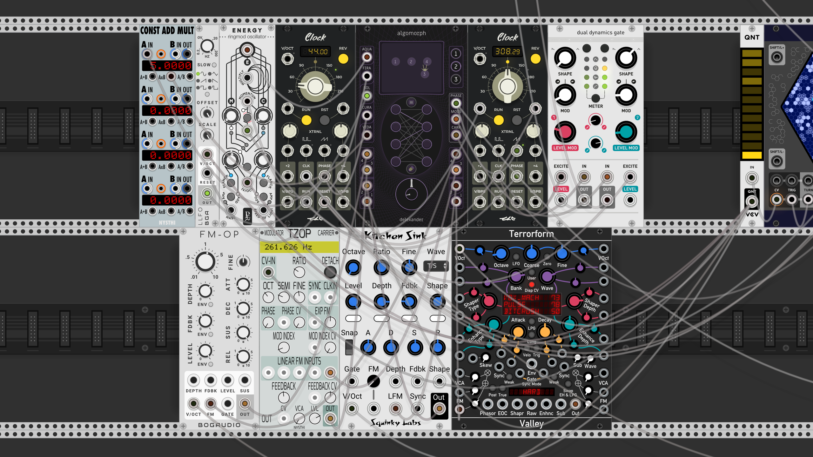
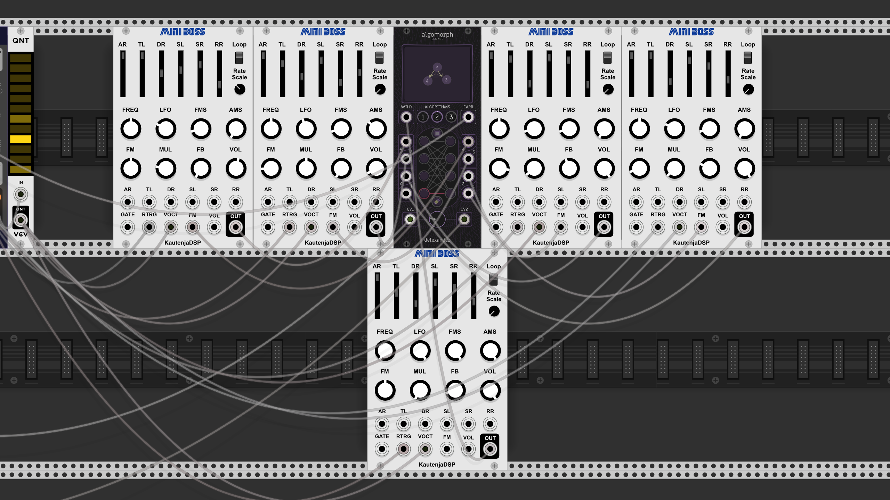
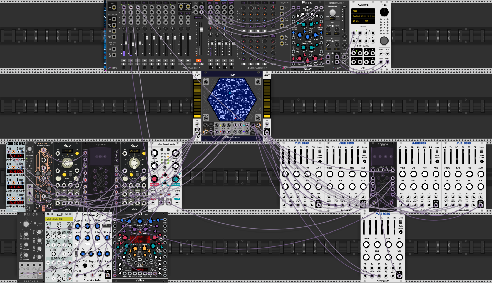

# Algomorph
Algomorph is a module for [VCV Rack](https://github.com/VCVRack/Rack).

Algomorph is an intelligent signal router, building from the familiar concepts of FM algorithms and expanding in service of both FM synthesis as well as general-purpose audio and CV routing.

Algomorph is capable of storing three independing routing states and crossfading between them. Crossfading can be controlled both manually and via control voltage, including at audio rates.

Algomorph includes a visualizer which displays the current algorithm as a directed graph. The graph visualizations are hardcoded, and the vector data is generated using a combination of manual dot-language enumeration of the problem-space (1979 graphs as defined for the purposes of this project), rendering to SVG via [GraphViz](https://graphviz.org/), and further processing with [Beautiful Soup](https://www.crummy.com/software/BeautifulSoup/).

Algomorph features five user-assignable CV/trigger/audio inputs, two sum outputs (each of whose state is determined by algorithm and morphing), and a phase output. Try feeding Algomorph multiple clocked modulation sources as Morph CV, then use the phase output as a combined clock source and/or a source of combined Morph CV for chaining with a second Algomorph module.

Algomorph has a user-assignable auxiliary knob located at the center of the main Morph Knob. By default, this functions as a morph CV attenuverter.

It is intended for use with modules capable of linear through-zero FM, or phase modulation, such as these operators:
* Bogaudio [FM-OP](https://library.vcvrack.com/Bogaudio/Bogaudio-FMOp)
* NYSTHI [µOPERATOR](https://library.vcvrack.com/NYSTHI/OP)/[TZOP](https://library.vcvrack.com/NYSTHI/TZOP)
* Squinky Labs [Kitchen Sink](https://library.vcvrack.com/squinkylabs-plug1/squinkylabs-wvco)
* Submarine [PO-204](https://library.vcvrack.com/SubmarineFree/PO-204)
* Valley Audio [Terrorform](https://library.vcvrack.com/Valley/Terrorform)
* KauntenjaDSP [Mini Boss](https://github.com/Kautenja/PotatoChips/releases/tag/1.10.0)

Specifications:
* 4 operator inputs
* 4 modulator outputs
* 1 carrier sum output
* 1 modulator sum output
* 1 phase output
* 5 assignable aux inputs, with 18 possible modes and optional multimode
* 6 built-in preset assignments for the aux inputs
* 3 configurable strengths for Morph CV inputs: standard, double, and triple
* 1 morph knob
* 1 assignable aux knob, with 10 possible modes including an endless rotary morph mode
* 3 algorithm slots
* Click/pop filters across all audio paths, with user-configurable strength
* 2 separate modes for the routing logic: standard and "Alter Ego"
* Expected CV range: +/- 5V
* Phase output configurable 0-10V or +/- 5V
* Lights that respond to the levels of incoming and outgoing audio
* A dynamiclly morphing display capable of displaying 1979 graphs, as well as a question mark when a graph cannot be visualized
* 11 purple/yellow/red ring lights, with additional rotational indicator functionality for improved informational clarity and density

Instructions:

* To install a [pre-compiled build](https://github.com/anlexmatos/FM-Delexander/releases/tag/AzureCI), follow [these directions](https://vcvrack.com/manual/Installing#installing-plugins-not-available-on-the-vcv-library).
* Connect the output of up to four operators to the Operator Inputs.  
* Connect the same number of Modulation Outputs from Algomorph to the linear through-zero FM inputs of the operators.  
* Connect the Carrier Sum output to your audio device or a mixer.  
* Press an Operator Button followed by a Modulation Button to connect one operator to another. Repeat until you have built a desired algorithm.  
* After you have finished building your algorithm, press Algorithm Button 1 or 3 to build a new algorithm.  
* The Morph knob allows for crossfading between the stored algorithms. 12 o'clock is the currently selected algorithm, while 7 o'clock is one algorithm to the left and 5 o'clock is one algorithm to the right.  
* The CV input can also be used instead of (or in addition to) the knob, accepting +/- 5V
* Connecting an operator to its own modulation output will disable that operator, silencing its output and removing it from the Sum output for that algorithm.
* To force an operator to act as carrier even when it is acting as a modulator, press its corresponding modulator button while the operator is not selected. A rotating indicator light will confirm the operator is now a forced-carrier for the current algorithm.
* The assignments for the AUX inputs and AUX knob can be found at a glance in the module's contextual menu, and from there they can also be changed. Be sure to check out Algomorph's included presets, each of which changes the configuration for the five AUX inputs.

There is additionally an "Alter Ego" mode of operation, which makes has two significant differences:

* Operators can be routed horizontally. Making horizontal connections does not disable operators here.
* Automatic carrier assignment does not occur. The only operators which are routed to the Sum output are those which are forcible marked as carriers by the user (see instructions above).

Note: while the expected CV range is scaled around +/- 5V, the morph CV inputs will actually accept "unlimited" voltage in either the positive or negative direction. At standard morph strength, 15V is equivalent to 0V. At triple morph strength, -5V = 0V = 5V. Try feeding a +/- 5V LFO through a multiplier like NYSTHI [ConstAddMult](https://library.vcvrack.com/NYSTHI/ConstAddMult) for some truly wild circular morphing at high rates of multiplication.

