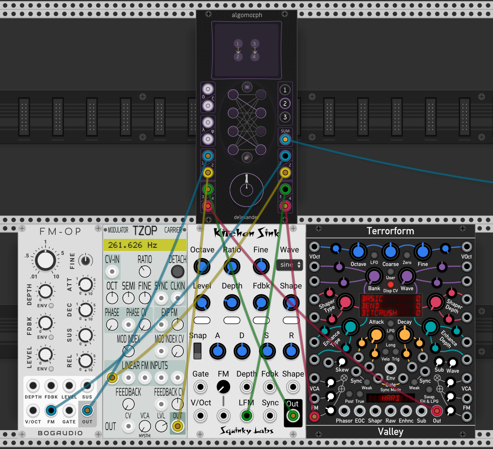

# Algomorph
Algomorph is a VCV Rack module which aids in the construction and visualization of FM algorithms. In addition, the module allows for storing up to 3 different algorithms and freely crossfading between them.

It is intended for use with modules capable of linear through-zero FM, or phase modulation, such as:
* Bogaudio [FM-OP](https://library.vcvrack.com/Bogaudio/Bogaudio-FMOp)
* NYSTHI [µOPERATOR](https://library.vcvrack.com/NYSTHI/OP)/[TZOP](https://library.vcvrack.com/NYSTHI/TZOP)
* Squinky Labs [Kitchen Sink](https://library.vcvrack.com/squinkylabs-plug1/squinkylabs-wvco)
* Submarine [PO-204](https://library.vcvrack.com/SubmarineFree/PO-204)
* Valley Audio [Terrorform](https://library.vcvrack.com/Valley/Terrorform)

However, there are several configuration options available which expand the possibilities for using Algomorph as a more general-purpose signal router outside the realm of FM algorithms. Creativity is encouraged!

Specifications:
* 4 operator inputs
* 4 modulator outputs
* 1 carrier sum output
* 4 assignable aux inputs, with 18 possible modes
* 1 morph knob
* 1 assignable knob, with 10 possible modes
* 3 algorithm slots
* Expected CV range: +/- 5V

Instructions:

* To install a [pre-compiled build](https://github.com/anlexmatos/FM-Delexander/releases/tag/AzureCI), follow [these directions](https://vcvrack.com/manual/Installing#installing-plugins-not-available-on-the-vcv-library).
* Connect the output of up to four operators to the Operator Inputs.  
* Connect the same number of Modulation Outputs from Algomorph to the linear through-zero FM inputs of the operators.  
* Connect the Sum output to your audio device or a mixer.  
* Press an Operator Button followed by a Modulation Button to connect one operator to another. Repeat until you have built a desired algorithm.  
* After you have finished building your algorithm, press Algorithm Button 1 or 2 to build a new algorithm.  
* The Morph knob allows for crossfading between the stored algorithms. 12 o'clock is the currently selected algorithm, while 7 o'clock is one algorithm to the left and 5 o'clock is one algorithm to the right.  
* The CV input can also be used instead of (or in addition to) the knob, accepting +/-5V.
* Connecting an operator to its own modulation output will disable that operator, silencing its output and removing it from the Sum output for that algorithm.
* To force an operator to act as carrier even when it is acting as a modulator, press its corresponding modulator button while the operator is not selected. A rotating indicator light will confirm the operator is now a forced-carrier for the current algorithm.
* The assignments for the AUX inputs and AUX knob can be found at a glance in the module's contextual menu, and from there they can also be changed. Be sure to check out Algomorph's included presets, each of which changes contains a configuration for the four AUX inputs.

There is additionally an "Alter Ego" mode of operation, which makes has two significant differences:

* Operators can be routed horizontally. Making horizontal connections does not disable operators here.
* Automatic carrier assignment does not occur. The only operators which are routed to the Sum output are those which are forcible marked as carriers by the user (see instructions above).

